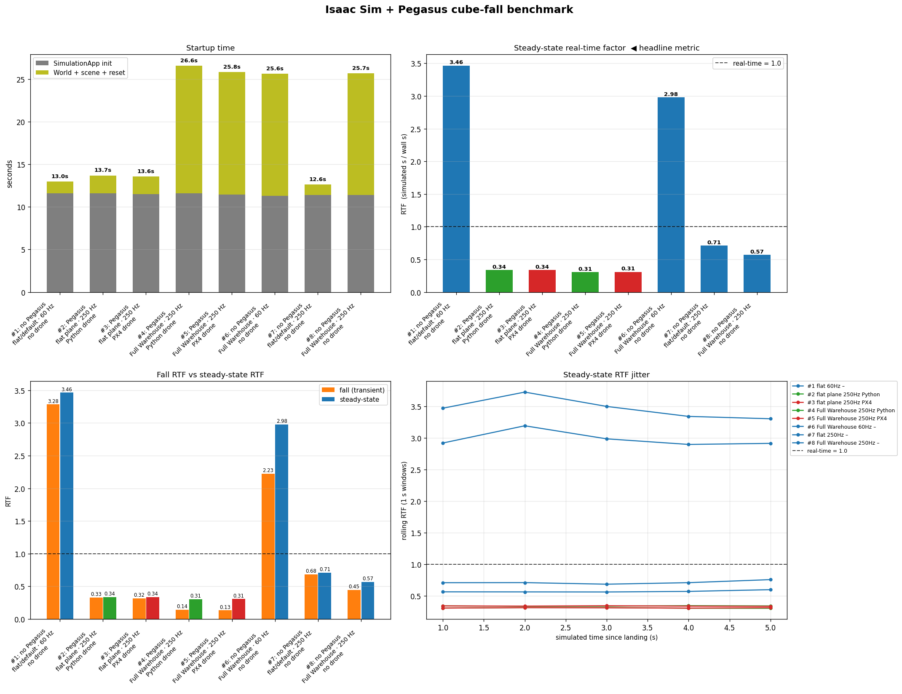

# Benchmark Analysis: Why Is Pegasus Slow?

## Setup

Eight standalone Isaac Sim scripts each time a 0.5 m cube falling 10 m onto a ground plane under different configurations. Two timing phases are measured per run:

- **Fall phase** (~1.4 s simulated): cube drop from spawn to landing
- **Steady-state phase** (5 s simulated): post-landing, stable RTF sample

**Headline metric:** real-time factor (RTF) = simulated seconds / wall-clock seconds. RTF > 1 means faster than real time; RTF < 1 means slower.

All runs were done with `headless: false` (windowed), so rendering overhead is present equally across all scripts.

---

## Results Summary

| # | Config | physics_dt | Steady RTF |
|---|--------|-----------|-----------|
| 1 | No Pegasus, default ground plane, 60 Hz | 1/60 | **3.46** |
| 7 | No Pegasus, default ground plane, 250 Hz | 1/250 | **0.71** |
| 2 | Pegasus + Python drone, Flat Plane, 250 Hz | 1/250 | **0.34** |
| 3 | Pegasus + PX4 drone, Flat Plane, 250 Hz | 1/250 | **0.34** |
| 6 | No Pegasus, Full Warehouse, 60 Hz | 1/60 | **2.98** |
| 8 | No Pegasus, Full Warehouse, 250 Hz | 1/250 | **0.57** |
| 4 | Pegasus + Python drone, Full Warehouse, 250 Hz | 1/250 | **0.31** |
| 5 | Pegasus + PX4 drone, Full Warehouse, 250 Hz | 1/250 | **0.31** |


---

## Key Findings

### 1. PX4 is NOT the bottleneck — the hypothesis is wrong

The original hypothesis was that PX4's 250 Hz MAVLink lockstep loop causes the slowdown. The data directly refutes this:

| Script | Backend | Steady RTF |
|--------|---------|-----------|
| 2 — Pegasus, flat, Python | NonlinearController (in-process) | 0.336 |
| 3 — Pegasus, flat, PX4 | MAVLink 250 Hz lockstep | 0.336 |
| 4 — Pegasus, warehouse, Python | NonlinearController (in-process) | 0.306 |
| 5 — Pegasus, warehouse, PX4 | MAVLink 250 Hz lockstep | 0.307 |

Swapping in PX4 produces no measurable difference in RTF. The MAVLink serialization, TCP communication, and lockstep synchronization with PX4 consume negligible wall-clock time relative to the physics simulation itself.

### 2. The 250 Hz physics step rate is the primary cause

| Script | physics_dt | Scene | Steady RTF |
|--------|-----------|-------|-----------|
| 1 | 1/60 (60 Hz) | ground plane | 3.46 |
| 7 | 1/250 (250 Hz) | ground plane | 0.71 |
| 6 | 1/60 (60 Hz) | Full Warehouse | 2.98 |
| 8 | 1/250 (250 Hz) | Full Warehouse | 0.57 |

Going from 60 Hz to 250 Hz with nothing else changing — no Pegasus, no drone — drops RTF from **3.46 → 0.71**, a **4.9× slowdown**. The machine cannot tick the PhysX engine 250 times per second fast enough to keep up with simulated time.

This is the root cause. `WORLD_SETTINGS['px4']` in [params.py](../extensions/pegasus.simulator/pegasus/simulator/params.py) hard-codes `physics_dt = 1/250` for all Pegasus simulations, including the Python backend which has no need of it.

### 3. Pegasus + drone simulation adds another ~2× overhead

Comparing no-Pegasus vs. Pegasus at the same 250 Hz physics rate:

| Script | Config | Steady RTF | Drop vs 250 Hz baseline |
|--------|--------|-----------|------------------------|
| 7 | No Pegasus, 250 Hz, flat | 0.71 | — |
| 2 | Pegasus + Python drone, 250 Hz, flat | 0.34 | −52% |
| 8 | No Pegasus, 250 Hz, warehouse | 0.57 | — |
| 4 | Pegasus + Python drone, 250 Hz, warehouse | 0.31 | −46% |

The Pegasus per-step overhead — articulation physics for the Iris quadrotor, rotor force application, and the `update_state()` / `update_sensor()` / `update(dt)` callback chain running 250×/s — cuts RTF roughly in half, independent of backend choice.

### 4. Scene complexity is a startup problem, not a runtime problem

Full Warehouse adds ~13 s to startup (USD streaming and mesh loading) but reduces steady-state RTF by only ~20% at 250 Hz with no drone (0.71 → 0.57), and by less than 10% when the drone is already dominant (0.34 → 0.31).

| Script | Startup total (s) | Steady RTF |
|--------|------------------|-----------|
| 7 — no Pegasus, flat, 250 Hz | 12.6 | 0.71 |
| 8 — no Pegasus, warehouse, 250 Hz | 25.7 | 0.57 |
| 2 — Pegasus, flat, 250 Hz | 13.7 | 0.34 |
| 4 — Pegasus, warehouse, 250 Hz | 26.6 | 0.31 |

Scene choice matters mainly for iteration time (how fast the script reaches simulation), not for ongoing simulation speed.

---

## Cause Attribution

Stacking the contributing slowdown factors from the 60 Hz no-Pegasus baseline:

```
RTF 3.46   Script 1: no Pegasus, 60 Hz physics, simple scene
     ↓  ÷4.9×  250 Hz physics step rate (WORLD_SETTINGS forces this)
RTF 0.71   Script 7: no Pegasus, 250 Hz physics, simple scene
     ↓  ÷2.1×  Pegasus extension + Iris drone articulation + per-step callbacks
RTF 0.34   Script 2/3: Pegasus, 250 Hz, flat, Python or PX4 (indistinguishable)
     ↓  ÷1.1×  Full Warehouse scene rendering overhead
RTF 0.31   Script 4/5: Pegasus, 250 Hz, warehouse, Python or PX4 (indistinguishable)
```

PX4 contributes 0% of the slowdown. The 250 Hz physics rate contributes ~70% of the total slowdown; Pegasus/drone overhead contributes the remaining ~30%.

---

## Recommendations

### High impact

**1. Decouple physics step rate from MAVLink update rate** *(the primary fix)*

The 250 Hz physics rate is enforced globally in `WORLD_SETTINGS['px4']` even for backends that don't need it. The physics step rate and the PX4 sensor packet rate are conflated but need not be. Options:

- **Per-backend `physics_dt`**: set `physics_dt = 1/250` only when a PX4 backend is actually in use; default to a more comfortable rate (e.g. 1/100 or 1/60) otherwise. This recovers the 5× loss for non-PX4 simulations.
- **Sub-stepped MAVLink**: run physics at e.g. 1/60 and sub-step the MAVLink sensor publish within each physics step to satisfy PX4's 250 Hz expectation. Complex to implement but would recover performance even for PX4 users.

**2. Switch physics device from CPU to GPU**

`WORLD_SETTINGS` currently sets `"device": "cpu"` for all backends. Moving to GPU PhysX (set `"device": "cuda"`) allows many more physics steps per second, especially important at 250 Hz with articulated robots. Verify GPU physics supports the Iris articulation before switching.

### Medium impact

**3. Profile the per-step drone callbacks**

The 2× RTF loss from Pegasus + drone (0.71 → 0.34) is significant but opaque. The callback chain — `update_state()`, `update_sensor()` (GPS, IMU, barometer, magnetometer), and backend `update(dt)` — runs 250×/s per vehicle. Profiling with `cProfile` or `py-spy` on a Pegasus-only run (script 2) would identify whether the bottleneck is sensor model computation, Python overhead in the callback chain, or the rotor aerodynamics force application.

**4. Run headless for production workloads**

These benchmarks used `headless: false`. Switching to `headless: true` eliminates the render loop. At 250 Hz this is a secondary saving (rendering_dt is 1/60 regardless of physics_dt), but it removes GPU contention and any vsync-related blocking.

### Low impact

**5. Prefer simpler scenes where feasible**

Full Warehouse adds ~13 s to startup and ~10% to steady-state cost. If the scenario doesn't require complex geometry, using Flat Plane or Default Environment reduces both.
